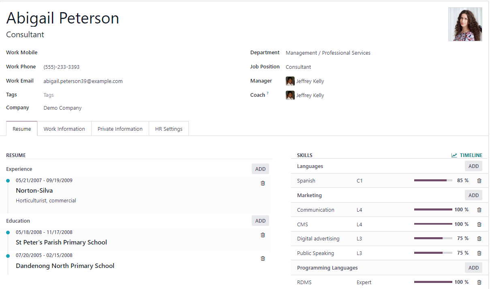
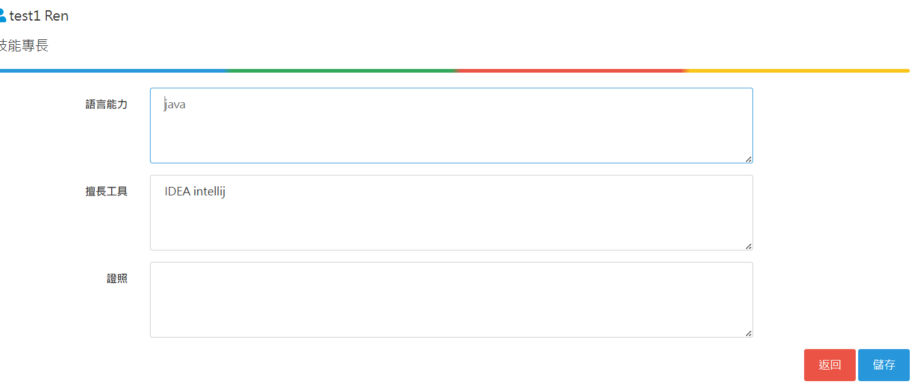
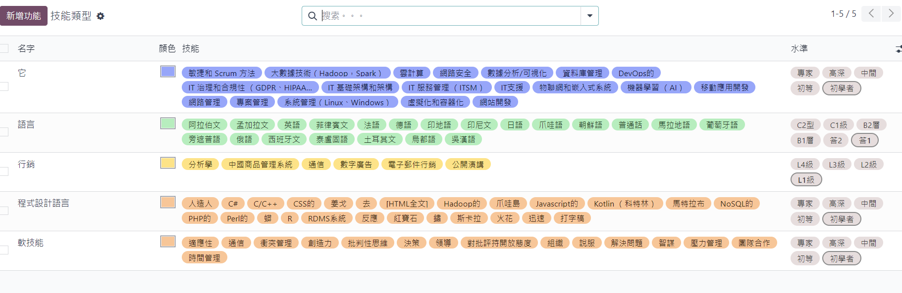

[cols="1,1,1", options="header"]

= Odoo vs nuEIP (nuHRM)

[cols="2a,2a,2a"]
|===
| 特點 | Odoo 描述 | nuHRM 描述

| Strength(優勢)
| * 多樣擴充功能：相當多擴充功能 可以根據公司需求去新增功能項
* 快速員工技能查詢：快速查詢員工技能
* 靈活篩選功能：可以用員工技能/部門等來篩選員工
* 自定義設定：內部的config包含了許多不同的設定
* 界面直觀：使用者能夠輕鬆找到所需資訊
* 多插件支持：多plugin可以提升系統靈活性
* 節省成本：從核心功能開始，並隨著需求的增加逐步添加更多功能 
* 可根據組織需求靈活定制系統，並與業務流程的變化保持同步 
| * 全面的人力資源管理功能：包括招聘、培訓、考核等，支持內部招聘和人才流動
* 客製化：可以根據企業需求進行功能和介面的客製化，滿足特定需求
* 支持內部招聘：允許管理者在公司內部進行招聘，提升人才內部流動性
* 數據分析功能：提供詳細的報告和分析，幫助決策
* 簡易好上手，學習曲線低
* 有排班功能、Line 打卡
* 客服回應速度快

| Weakness(弱點)
| * 功能模組挑戰：模組太多，可能需要花更多時間成本來確保模組之間整合跟一致性
* 學習曲線較陡：非常多功能跟靈活，可能需要花更多時間成本學習跟掌握
| * 成本較高：全面的人力資源管理系統通常價格較高，對於小型企業可能不夠實惠。
* 系統整合難度：與其他系統的整合可能需要額外的開發工作和技術支持
* 缺乏人才精準搜尋系統
* 擴充功能少

| Opportunity(機會)
| * Scalability 極高 隨公司發展odoo的多功能性有辦法去以高索引姓的特點去管理每一位員工
* 跨國語言
* flexibility 極高 有許多第三方應用程式的擴展性
| * 擴展功能：可以加入更多先進的人力資源管理功能，如人工智能分析和自動化流程
* 拓展市場：吸引更多中小企業，提供經濟實惠的方案，擴大市場份額
* 提升用戶體驗：改善系統界面和功能，提升使用者滿意度和系統易用性

| Threats(威脅)
| * 競爭壓力：市場上有許多 ERP 供應商，包括一些針對特定行業的專門系統
* 需求多樣化：由於 Odoo 的開源特性，客戶期望更多定制化功能，這對於保持產品一致性和穩定性帶來挑戰
* 開源社群依賴：面臨社區開發者對於產品方向的影響，以及開源軟件的維護和安全問題
| * 競爭壓力：市場上有許多 ERP 供應商，包括一些針對特定行業的專門系統
* 技術變化快：需要不斷跟上技術變化，避免系統過時
* 需求多樣化：不同企業對 HR 系統的需求不同，需要持續改進以滿足市場需求
|===

== Odoo 特點
* 我覺得技能這點相當的詳細，身為一個主管應該不會有任何問題去找尋部門需要的員工，HR應該會看的很清楚各種東西，（前提是要會用）技能不光是簡單的標籤，更有技能程度、成長曲線等，甚至可以去看到報表及員工的成長曲線。

== nuHRM 特點
* 整合LINE雲端服務簡化企業流程，提升管理效率。

=== Odoo 員工檔案管理
* 基本信息管理：每位員工都有一個詳細的檔案，包括個人信息（如姓名、聯絡方式、照片、社會安全號碼等）、職位、部門、主管信息等。
* 文件存儲：企業可以在員工檔案中附加相關文件，例如合同、證書、簡歷、績效評估報告等，並支持分類和標記，方便未來查閱。
* 動態時間線：每個員工檔案都有一個動態時間線，記錄了與該員工相關的重要事件和活動，如升遷、調職、合同更新等。這樣的設計幫助管理者在需要時快速追溯員工的工作歷史。

=== nuHRM 員工檔案管理
* 人資系統無法直接觀看更多員工相關信息，須進入編輯人員畫面。

image::NUEip.png[NUEip, align=center]

=== nuHRM 技能只能輸入文字 無法像odoo一樣標籤選擇

