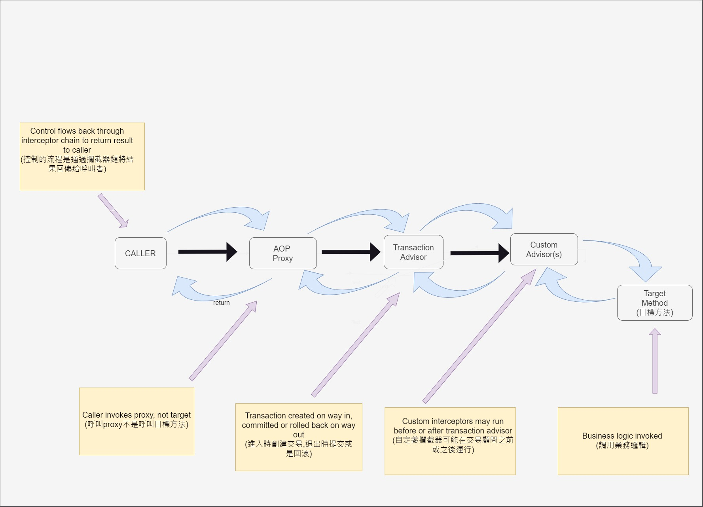

== Transaction Deep Dive

== 基本流程
. 標記方法或類別：
在方法或類別上加上 @Transactional 註解。
. 啟用註解驅動的事務管理：
在配置類上加上 @EnableTransactionManagement 註解，或在 XML 配置中使用 tx:annotation-driven/ 標籤。
. 代理創建：
Spring 容器啟動時，會為標記了 @Transactional 的 Bean 創建一個代理對象。
. 方法調用攔截：
當被呼叫Transactional 標記的方法時，請求會先被代理對象攔截。
. 事務開始：
代理對象會呼叫 PlatformTransactionManager 開啟一個新的事務。
. 執行業務邏輯：
代理對象呼叫原始方法，執行實際的業務邏輯。
. 異常處理：
如果方法執行期間拋出異常，代理對象會根據 @Transactional 的設定決定是否回滾。
. 事務提交或回滾：
** 如果方法正常執行完成，代理對象會調用 PlatformTransactionManager 提交。
** 如果發生需要回滾的異常，代理對象會調用 PlatformTransactionManager 回滾。
. 返回結果：
最後，代理對象將方法的執行結果（或異常）返回給調用者。

* What is PlatformTransactionManager?
** Spring Transaction 裡主要的 interface，提供 getTransaction(TransactionDefinition definition), commit(TransactionStatus status), rollback(TransactionStatus status) 給不同的資料庫去實作

== AOP Proxy
Spring AOP 使用兩種方式來創建代理：

. JDK 動態代理：
* 用於實現了介面的類別
* 基於 Java 的 java.lang.reflect.Proxy 類別
* 創建一個實現相同介面的新類別
. CGLIB 代理：
* 用於沒有實現介面的類別，或當 proxyTargetClass=true
* CGLIB 是一個強大的位元組碼生成函式庫
* 通過生成目標類別的子類別來創建代理

CGLIB 代理的工作原理：

. 在執行時期動態生成目標類別的子類別
. 覆寫父類別的方法，在呼叫父類別方法前後插入代理邏輯
. 使用 MethodInterceptor 介面攔截所有方法呼叫

代理類別生成過程：

. CGLIB 創建 Enhancer 物件
. 設置父類別（被代理的類別）
. 設置回呼（如 MethodInterceptor）
. 呼叫 Enhancer.create() 方法生成代理類別的位元組碼
. 將位元組碼轉換為 Class 物件

== @Transactional 無效的情況
. 非 public 方法
** @Transactional 只對 public 方法有效(6.0以後新增加protected or package-visible methods)
. 同類內部呼叫
** 在同一個類中，非交易方法呼叫帶有 @Transactional 註解的方法
. 錯誤的傳播設置
** 使用 PROPAGATION_SUPPORTS、PROPAGATION_NOT_SUPPORTED 或 PROPAGATION_NEVER
. 類別未被 Spring 管理
** 使用 'new' 關鍵字創建的對象，而不是 Spring 管理的 Bean
. 配置中未啟用 AOP
** 缺少 @EnableAspectJAutoProxy 或相關的 XML 配置
. 使用 proxyTargetClass = false 且類別未實現介面
** JDK 動態代理需要介面
. final 或 static 方法/類別
** CGLIB 無法為 final 類別或方法生成代理
. 異常處理問題
** 捕獲異常但未重新拋出
** 預設情況下，只有未捕獲的 RuntimeException 會觸發 rolback
. 資料庫不支援交易
** 確保使用的資料庫支援交易機制
. 運行時交易處理方式配置不當
** 如錯誤設置 rollbackFor 或 propagation 屬性

== @Transactional config

* Propagation level
REQUIRED:: 加入現有交易，如果沒有交易則創建一個新的。
REQUIRES_NEW:: 總是創建一個新交易，暫停任何現有交易。
MANDATORY:: 支持當前交易，如果沒有交易則拋出異常。
SUPPORTS:: 如果有交易則參與交易，如果沒有交易則非交易性執行。
NOT_SUPPORTED:: 不支持當前交易，如果有交易則暫停它。
NEVER:: 非交易性執行，如果存在交易則拋出異常。
NESTED (only works with JDBC):: 如果存在當前交易，則在嵌套交易中執行。
* Isolation level 
DEFAULT:: 使用資料庫預設的隔離等級
READ_UNCOMMITTED::
最低的隔離等級 +
允許讀取未提交的資料變更，可能會導致髒讀、不可重複讀和幻讀
READ_COMMITTED::
防止髒讀，但不可重複讀和幻讀仍可能發生
REPEATABLE_READ::
防止髒讀和不可重複讀，但幻讀仍可能發生
SERIALIZABLE::
最高的隔離等級 +
完全服從 ACID 的隔離等級，防止髒讀、不可重複讀和幻讀
READ_ONLY（Spring 特有）::
表示事務只會讀取資料但不會修改資料 +
可以幫助資料庫引擎最佳化事務
SNAPSHOT（某些資料庫特有，如 SQL Server）::
基於多版本並行控制（MVCC） +
每個事務看到的是資料庫在事務開始時的一致性快照

